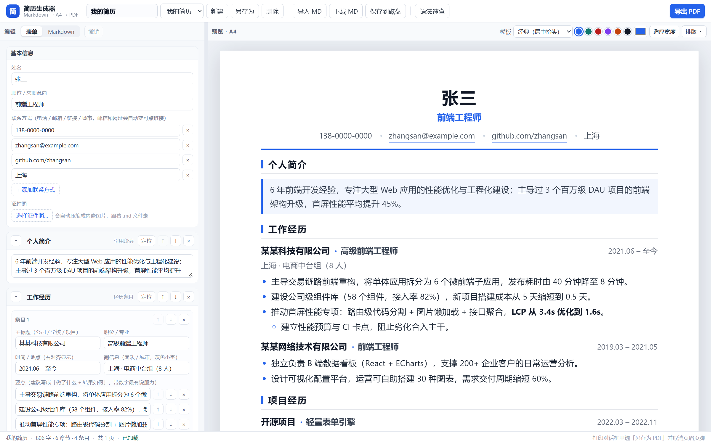

# 简历生成器

填表或写 Markdown 都能做简历，实时看 A4 排版，一键导出 PDF。**零依赖、纯本地**：不用装、不联网、不上传，一份 `.md` 就是你的简历。

> 在线版（GitHub Pages）：<https://beiwei91.github.io/resume-generator/> —— 手机、别人的电脑打开就能用；数据仍然只存在你自己的浏览器里。



## 开始使用

三种方式，任选一种：

```powershell
# ① 推荐：双击「启动简历生成器.vbs」
#    用应用窗口打开（无地址栏、无标签页），没有后台进程，也不需要 Node

# ② 双击「简历生成器-单文件.html」
#    一个 HTML 文件搞定，拷到 U 盘、发给同事都能直接打开

# ③ 不要界面，直接把 Markdown 导出成 PDF（这条路需要 Node）
node export-pdf.mjs resume.sample.md -o 简历.pdf
```

界面左边填内容，右边就是 A4 预览。首次打开会载入示例简历，直接改就行。

## 两种编辑方式（同一份文件，随时切换）

左边默认是「**表单**」页签：**不用写任何 Markdown**，按模块填。

- **基本信息**：姓名、职位、联系方式（可增删多条）、证件照
- **每个章节一张卡片**：可折叠、可上移 / 下移 / 删除；「定位」会在右侧预览里高亮对应位置
- **经历条目**：主标题 / 职位 / 时间 / 副信息 分开填，要点逐条增删排序（二级要点有专门按钮）
- **表格章节**（技能清单等）：直接改单元格、加行删行
- **要点列表 / 引用 / 正文**：按章节类型给对应编辑器
- 底部「**+ 添加章节**」按常见板块（工作经历、项目经历、教育背景、技能清单…）一键添加
- 改错了按 `Ctrl + Z` 或点「撤销」

切到「**Markdown**」页签就是原始文本，两边改动实时互通 —— 表单只是"看得见的编辑器"，底层存的仍然是 `.md`，所以文件照样能进 Git、发给别人、换电脑还原。

**手机上也能用**：窄屏会自动换成「✎ 编辑 / 👁 预览」两个视图（一次显示一个，避免挤在一起），顶栏只留「更多 ⋯」和「导出 PDF」，表单字段一行一个，A4 纸自动缩放到屏幕宽度——所以在线版在手机上打开就能看简历、改内容、导出 PDF。

## 界面功能

**顶部工具栏**：文档名（也是导出 PDF 的文件名）、已保存文档、新建 / 另存为 / 删除、导入 MD、下载 MD、保存到磁盘、语法速查、导出 PDF。

**编辑区**：表单 / Markdown 页签、撤销；Markdown 模式下还有加粗、斜体、行内代码、章节、条目、要点、表格、分页、分隔线、**证件照**等插入按钮。

**预览区右上**：模板、主色、「排版」面板（字体 / 字号 / 行距 / 页边距 / 缩放 / 分页参考线，有证件照时会多出宽度 / 位置 / 形状与「移除证件照」）。

| 快捷键 | 作用 |
| --- | --- |
| `Ctrl + S` | 保存（浏览器文档库，或用系统文件选择器写回磁盘） |
| `Ctrl + P` | 导出 PDF |
| `Ctrl + Z` | 撤销上一步（表单模式） |
| `Ctrl + B` | 加粗选中文本（Markdown 模式） |
| `Tab` | 插入两个空格（Markdown 模式的列表里就是二级要点） |
| `Enter` | 列表项自动续写下一个标记（Markdown 模式） |
| 拖 `.md` 到编辑区 | 导入该文件 |

## Markdown 语法

````markdown
---
template: classic        # classic 居中抬头 | modern 色块标题 | compact 紧凑单行
accent: #2563eb          # 主题色
font: sans               # sans（雅黑/苹方）| serif（宋体/思源宋体）
fontSize: 14px           # 10 ~ 20
lineHeight: 1.65         # 1.15 ~ 2.4
margin: 16mm 18mm        # 上下 左右
photo: ./证件照.jpg       # 证件照（可省略；见下方说明）
photoSize: 26mm          # 证件照宽度，高度按图片比例
---

# 张三                                      ← 姓名（第一个 # 标题）

前端工程师 | 138-0000-0000 | me@mail.com     ← 紧跟姓名：第一段是职位，
                                               其余按 | 拆成联系方式（邮箱/网址自动变链接）

## 工作经历                                 ← 章节

### 某公司 · 高级前端工程师 | 2021.06 – 至今   ← 条目：· 前主标题、· 后职位、| 后右对齐时间

**上海 · 电商中台组**                        ← 条目下第一段（含年份/·/| 时）是灰色副信息行

- 做了什么，结果如何：用数字量化
  - 行首两个空格 = 二级要点
- **加粗**、*斜体*、`代码`、[链接](https://example.com) 可混用

| 技能 | 说明 |                              ← 表格
| --- | --- |
| 语言 | TypeScript、JavaScript |

> 引用块（适合个人简介）

---                                          ← 单独一行 = 手动分页
***                                          ← 分隔线
````

文首配置块必须在文件最开头；界面上的排版控件会**自动改写文首配置块**，所以内容和样式永远在同一个文件里，换电脑导入即可还原。

### 证件照

点编辑区的「**证件照**」按钮选图即可：自动等比压缩（最长边 720px、JPEG）、铺白底，然后内嵌进 `.md`，抬头右上角立刻出现照片。想调大小或去掉，用「排版」面板里的宽度滑杆、「位置」（右侧 / 左侧）、「形状」（圆角 / 圆形 / 直角）和「移除证件照」。（想试效果可以直接拿 `assets/sample-photo.png` 当素材。）

**有照片时抬头会自动换成两列版式**：文字靠左、照片靠右（或靠左），两者垂直居中——不会出现"姓名被挤在居中列里、照片下面空一块"的别扭样子。

也可以手写（两种写法等价）：

```markdown
---
photo: ./证件照.jpg      # 或 https://… 、file:///D:/… 、data:image:…（内嵌）
photoSize: 26mm          # 宽度，默认 26mm（高度按图片比例）
photoAlign: right        # right（默认）| left
photoShape: rounded      # rounded（默认）| circle | square
---

# 张三

   ← 或者：写在姓名下一行的独立图片
```

照片地址支持相对路径、网址、`file:///` 与内嵌 data URI；写 Windows 绝对路径（`D:\photos\me.jpg`）会自动转成 `file:///D:/photos/me.jpg`。**推荐用按钮插入**（内嵌进 `.md`）：这样导出 PDF、发给别人、拷到别的电脑都不会丢图；用相对路径时，路径是相对**应用所在目录**，不是 `.md` 文件所在目录。

> 加证件照会让抬头变高一点（照片高度通常比姓名那几行高），原来刚好一页的简历可能被挤到第二页 —— 调小「证件照宽度」或精简几行即可。

一行 `` 也可以放进正文，图片不会超出纸张宽度。

## 导出 PDF

**方式一：界面「导出 PDF」**（推荐日常使用）

在弹出的打印对话框里：目标选「**另存为 PDF**」、**取消勾选「页眉和页脚」**、纸张 A4、缩放 100%，保存。页边距由简历自身决定，浏览器不会额外叠加。

导出的是矢量文字：可选中、可搜索、链接可点，中文字体已内嵌。

**方式二：命令行**

```powershell
node export-pdf.mjs resume.sample.md                      # 输出 resume.sample.pdf
node export-pdf.mjs 我的简历.md -o 张三-前端工程师.pdf
node export-pdf.mjs 我的简历.md --template modern --accent "#0f766e" --margin "14mm 16mm"
node export-pdf.mjs 我的简历.md --png 首页预览.png         # 额外导出首页 PNG
node export-pdf.mjs --help
```

参数 `--template / --accent / --font / --font-size / --line-height / --margin` 会临时覆盖配置块；`--browser <路径>` 可指定浏览器（也会自动在常见安装位置查找）。

## 自检

```powershell
npm test            # 渲染引擎 47 项 + 表单逻辑 41 项断言（解析、行内语法、模块识别、逐块改写）
npm run verify      # 导出链路：真的调 Chrome 出 PDF，校验 A4 尺寸、页边距、分页
npm run verify:app  # 双击即用链路：图标、启动器命令与 URL 编码、快捷方式、单文件版、表单渲染、无服务残留
```

## 目录结构

```
index.html                  工作台界面（表单 / Markdown 双模式 + 预览 + 导出）
assets/resume-md.js         渲染引擎：Markdown → 简历 HTML（浏览器 / Node 通用）
assets/resume-form.js       表单逻辑：把 Markdown 拆成模块并按块改写（可单测）
assets/form-view.js         表单界面：模块卡片、字段、增删排序
assets/resume.css           简历纸张样式 + 三套模板（预览与 PDF 共用）
assets/app.css / app.js     界面样式与逻辑
assets/icons/               图标（PNG + ICO，npm run icons 重新生成）
启动简历生成器.vbs            双击用应用窗口打开（无服务、无 Node）
创建桌面快捷方式.vbs          在桌面生成带图标的快捷方式
build-single.mjs            打包单文件便携版（npm run single）
简历生成器-单文件.html         单文件便携版（构建产物，双击即用）
export-pdf.mjs              命令行 PDF 导出
resume.sample.md            示例简历
tools/                      图标与启动器的生成脚本
tests/                      上面三个 npm 脚本对应的测试
可选-本地服务/                只有想把应用装成 PWA 时才需要，见目录内说明
```

## 常见问题

**表单模式识别不出我的内容？**
表单按固定约定认模块：`#` 姓名、`##` 章节、`###` 条目、`-` 要点、`|` 表格。不认识的复杂内容（嵌套引用等）会原样放进一个可编辑的「原文块」里，不会丢东西；实在特殊就切到 Markdown 页签改。

**表单里改动会不会破坏我的手工排版？**
不会。表单每次只重写"那一块"对应的几行，其余内容（包括文首配置块和手写的 Markdown 细节）一个字节都不动；测试里有一条不变式专门守这个（用原值改写后文档模型必须完全一致）。

**双击启动器后打开的是 Chrome 首页？**
说明 Chrome 没拿到合法的 `--app=` 值（实测：值不合法时 Chrome 就打开新标签页）。启动器已经把 URL 做了百分号编码，让命令行保持纯 ASCII；如果仍不行，直接双击 `简历生成器-单文件.html` 即可（等同双击普通网页，必定打开）。具体过程记在 `.launcher.log`。

**保存到磁盘时变成「下载」了？**
直接用浏览器打开本地 HTML（`file://`）时，浏览器不提供系统文件选择器，于是退化为下载，效果一样，只是要自己选保存位置。

**导出后多了一页，只有一两行？**
内容超出一页一点点。状态栏会显示「共 N 页」并高亮提醒。调小字号/行距、把页边距换成「窄」、精简要点，或在合适位置插一行 `---` 主动分页。

**界面里的「已保存」存在哪？**
浏览器 localStorage（键名前缀 `resume-gen:`）。清缓存或换浏览器就没了，重要简历请「下载 MD」或「保存到磁盘」留一份文件。

**能多人 / 多版本管理吗？**
`.md` 就是纯文本，放进 Git 就能看 diff、开分支、维护多份针对不同岗位的简历。

## 说明与限制

- 只支持单栏排版；没有滚动同步；页码依赖浏览器打印设置（程序不插入页码）。
- 预览里的虚线是估算的分页参考线，真实分页由浏览器打印引擎完成。
- 启动器和桌面快捷方式是 Windows 专用的 `.vbs`；macOS / Linux 直接双击 HTML 即可。
- `可选-本地服务/` 里是本地 HTTP 服务与 PWA（离线缓存）相关文件，默认用不到，只有想「安装成桌面应用」时才需要。

## 许可

MIT
